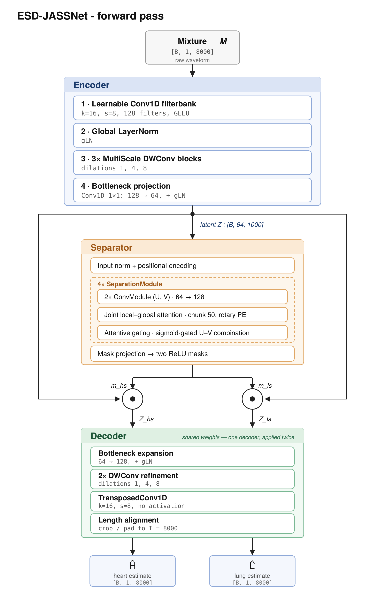

# Single-Channel Heart–Lung Sound Separation Across Acoustic Domains: Deep Learning and Semi-Supervised Adaptation

This repository contains the research code developed for the master's thesis **_Single-Channel Heart–Lung Sound Separation Across Acoustic Domains: Deep Learning and Semi-Supervised Adaptation_** by Pietro Callandrone. The project investigates whether a compact time-domain separator can operate across two acoustically different domains:

- a controlled source domain built from real-patient heart and lung recordings;
- a shifted target domain recorded from a clinical manikin.

The proposed system, **ESD-JASSNet**, combines multi-scale convolutional encoding, JASSNet-inspired local/global attention, replay-based target adaptation and confidence-filtered semi-supervised learning.

---

## Research problem

A digital stethoscope records heart sounds (HS) and lung sounds (LS) simultaneously as a single monaural signal. The two sources overlap substantially in time and frequency, especially in the approximate 20–500 Hz region, making fixed spectral filtering insufficient.
Given an observed cardiopulmonary mixture

$$
M(t) = H(t) + L(t),
$$

the separation task consists in estimating the two underlying source waveforms:

- $\hat{H}(t)$: estimated heart-sound waveform;
- $\hat{L}(t)$: estimated lung-sound waveform.

The thesis focuses not only on in-domain separation, but also on domain shift, target-domain adaptation, catastrophic-forgetting control, and the use of unlabelled physical mixtures through pseudo-labelling.

---

## Main contributions

The project includes:

1. **HLS-CMDS waveform-coherence audit**  
   Analysis of the physical mixtures and their associated isolated recordings before using them as waveform-level supervision.

2. **EXP_H benchmark construction**  
   A controlled, exactly additive and source-disjoint benchmark built from quality-screened PhysioNet 2016 heart sounds and ICBHI 2017 lung sounds.

3. **ESD-JASSNet**  
   A compact time-domain separator with approximately **300k trainable parameters**.

4. **Controlled and capacity-matched comparisons**  
   Capacity-matched JASSNet-like comparison results reported in the thesis. The auxiliary reconstruction code is not distributed in this public repository.

5. **Acoustic domain-gap analysis**  
   Quantification through RMS-normalised acoustic features, standardised mean differences, a domain classifier and CORAL covariance distance.

6. **Mixed fine-tuning with source replay**  
   Supervised target-domain adaptation while retaining source-domain separation quality.

7. **Confidence-filtered semi-supervised refinement**  
   Teacher-student adaptation using unlabelled HLS-CMDS V1 physical mixtures and input-output consistency filters.

---

## Proposed architecture

ESD-JASSNet is a compact end-to-end waveform separator operating on 2-second, 4 kHz mono segments with 300,608 trainable parameters.

<p align="center">
  
</p>

<p align="center">
  <em>Forward-pass architecture of the proposed ESD-JASSNet separator.</em>
</p>

The architecture combines a multi-scale convolutional encoder, four JASSNet-inspired local/global separation modules, two latent source masks and a shared decoder applied to the heart- and lung-sound representations.
At inference time, deterministic mixture-informed waveform calibration is additionally applied to resolve global polarity and gain ambiguities using only the observed mixture and the sum of the estimated sources.

---

## Multi-domain training pipeline

The final model is trained in three stages.

### Stage 1 — Source-domain supervised pre-training

The model is trained on **EXP_H**, an exactly additive benchmark constructed from real-patient source recordings.

Purpose:

- learn the initial HS/LS separation function;
- establish a strong source-domain checkpoint;
- provide the replay and retention reference for later adaptation stages.

The source-domain checkpoint was trained using the same supervised training implementation used by the adaptation code, with mixed-domain sampling and replay disabled. For this reason, a separate Stage-1 implementation is not duplicated in the repository.

### Stage 2 — Supervised target adaptation with replay

The EXP_H checkpoint is adapted to controlled HLS-CMDS target-domain mixtures constructed from standalone manikin HS and LS recordings.

A progressive curriculum increases the target-batch probability:

$$
p_{\mathrm{target}}: 0.30 \rightarrow 0.50 \rightarrow 0.70
$$

Low-weight EXP_H replay is retained during adaptation to reduce source-domain forgetting.

### Stage 3 — Confidence-filtered semi-supervised refinement

The frozen Stage-2 teacher generates pseudo-labels for unlabelled HLS-CMDS V1 physical mixtures. A segment is accepted only when it satisfies consistency and non-degeneracy constraints, including:

- reconstructed-mixture correlation $\geq 0.95$;
- reconstructed-mixture NMSE $\leq -10$ dB;
- bounded inter-output correlation;
- bounded pseudo-source energy ratio;
- non-silent outputs;
- admissible mixture-informed gain.

For the final teacher, 2,740 of 2,970 segments pass the filter, corresponding to a 92.3% acceptance rate.

---

## Datasets and experimental roles

The datasets are not interchangeable: each one has a specific role in the experimental protocol.

| Dataset or subset | Role in this project |
|---|---|
| **EXP_H** | Stage-1 pre-training, source replay, fixed source-domain retention evaluation and domain-gap reference |
| **HLS-CMDS standalone HS/LS** | Controlled target-domain mixture construction, target-only scratch experiments and five-fold source-disjoint validation |
| **HLS-CMDS V1 physical mixtures** | Unlabelled target-domain inputs for confidence-filtered pseudo-labelling |
| **HLS-CMDS V2** | Post-hoc physical-mixture coherence assessment; not used for training or checkpoint selection |
| **HF_Lung** | External real-patient lung-sound coverage audit and controlled external waveform validation |
| **RespiratoryDatabase@TR** | Mixture-only zero-shot consistency analysis without isolated waveform references |

### Source-disjoint protocol

The HLS-CMDS standalone source pool contains 50 independent HS recordings and 50 independent LS recordings. Five folds are created at source level:

- **training:** 40 HS sources and 40 LS sources;
- **validation:** 10 HS sources and 10 LS sources;
- no heart or lung recording appears in both training and validation within a fold.

EXP_H uses one fixed source-disjoint validation split. Its five retention values correspond to the five Torabi-adapted checkpoints evaluated on the same fixed EXP_H validation set; they are not an EXP_H cross-validation.

---

## Signal preprocessing

Unless otherwise specified by a baseline-specific protocol, waveforms are:

1. converted to mono;
2. resampled to 4 kHz;
3. DC-centred;
4. divided into 2-second windows;
5. segmented with a 0.5-second hop, corresponding to 75% overlap.

Controlled mixtures preserve additivity by applying source scaling followed by one shared triplet gain.

The Montoro M7 NMF baseline uses a separate 8 kHz, 7-second, STFT-based processing chain and must therefore be interpreted as a directional classical comparison rather than an identical end-to-end protocol.

---

## Training configuration

All final configurations use:

- Adam optimiser;
- batch size: 64;
- weight decay: 1e-5;
- gradient clipping: 5.0.

| Stage | Learning rate | Epochs | Patience | Replay weight | SSL weight |
|---|---:|---:|---:|---:|---:|
| EXP_H pre-training | 1e-4 | 30 | 5 | — | — |
| HLS-CMDS scratch reference | 1e-4 | 30 | 5 | — | — |
| Mixed fine-tuning | 1e-6 | 10 | 3 | 0.05 | — |
| SSL refinement | 1e-6 | 10 | 3 | 0.05 | 0.10 |

The supervised objective combines scale-invariant separation quality with absolute-amplitude and polarity constraints. During Stage 3, pseudo-labelled batches additionally use a low-weight mixture-consistency term.

---

## Main results

Five-fold target-domain means are reported for HLS-CMDS. EXP_H retention is evaluated on one fixed source-disjoint validation set.

| Model stage | HLS-CMDS HS SI-SDR | HLS-CMDS LS SI-SDR | EXP_H HS SI-SDR | EXP_H LS SI-SDR |
|---|---:|---:|---:|---:|
| EXP_H checkpoint, cross-domain transfer on HLS-CMDS | -1.98 dB | -0.20 dB | +8.33 dB | +7.66 dB |
| HLS-CMDS target-only scratch reference | +3.05 dB | +2.57 dB | — | — |
| Mixed fine-tuning | +3.48 dB | +2.69 dB | +8.02 dB | +7.37 dB |
| Final SSL refinement | **+3.78 dB** | **+2.96 dB** | **+7.99 dB** | **+7.32 dB** |

### EXP_H supervised performance

| Source | SI-SDR | SIR | SAR | Pearson correlation | NMSE |
|---|---:|---:|---:|---:|---:|
| Heart | +8.33 ± 5.53 dB | +18.94 dB | +9.45 dB | 0.815 | -9.415 dB |
| Lung | +7.66 ± 4.79 dB | +19.01 dB | +9.28 dB | 0.802 | -8.724 dB |

### Full-pipeline capacity comparison

| Model | Parameters | HLS-CMDS HS | HLS-CMDS LS | Mean SI-SDR | Mixture correlation | EXP_H retention HS / LS |
|---|---:|---:|---:|---:|---:|---:|
| **ESD-JASSNet** | 300,608 | **+3.78** | **+2.96** | **+3.37** | **0.987** | **+7.99 / +7.32** |
| JASSNet deeper | 300,480 | +3.67 | +2.69 | +3.18 | 0.511 | +7.14 / +6.78 |
| JASSNet wider | 295,872 | +3.61 | +2.68 | +3.15 | 0.498 | +6.85 / +6.45 |

Because the reconstructed JASSNet-like models do not use an identical training objective or inference procedure, these experiments should not be interpreted as a strict architecture-only causal ablation. They do show that parameter count alone is insufficient to reproduce the complete pipeline result.

---

## Evaluation

The experimental framework reports:

- SI-SDR;
- SDR, SIR and SAR;
- waveform Pearson correlation;
- mixture correlation;
- normalised mean squared error;
- gain and polarity diagnostics;
- global-SNR and local-SNR stratification;
- clustered bootstrap confidence intervals;
- paired clustered bootstrap for model comparisons;
- qualitative best, median and worst cases selected by metric rank.

Overlapping windows derived from the same full recording are not treated as statistically independent. Bootstrap resampling is therefore performed at the base-recording level.

---

## Domain-gap analysis

The source-target acoustic comparison uses 39 RMS-normalised features. The reported analysis finds:

- mean absolute standardised mean difference: **0.895**;
- 35 of 39 SMD confidence intervals excluding zero;
- linear domain-classifier ROC-AUC: **1.000** before first-order matching;
- ROC-AUC: **0.500** after fold-wise mean and standard-deviation matching;
- CORAL covariance distance: **1.995**, reduced to **0.355** after matching.

These measurements demonstrate a broad statistical mismatch in the analysed feature space. They do not, by themselves, identify a unique physical cause for the domain shift.

---
## Repository structure

```text
Assets/
`-- esd-jassnet_forward.png          Architecture figure

Codes/
|-- EXP_H_BUILD/                     EXP_H benchmark construction
|-- HLS_CMDS_BUILD/                  HLS-CMDS controlled-mixture and fold construction
|-- MIXED_TUNING/                    Supervised mixed-domain adaptation with source replay
|-- SSL_MIXED/                       Final semi-supervised ESD-JASSNet pipeline
|-- DOMAIN_GAP/                      Acoustic domain-gap analyses
|-- ERROR_ANALYSIS/                  Error analysis and statistical evaluation
`-- BUILD_HFLUNG_RESPIRATORYTR/      External-dataset preparation and audit scripts

Deliverables/
|-- DeepLearning_Model/              Representative deep-learning outputs
`-- NMF_Montoro/                     Representative reconstructed NMF outputs

HLS_CMDS_ALIGNED/
|-- HS/                              Standalone heart-sound recordings
|-- LS/                              Standalone lung-sound recordings
`-- Mix/                             Physical cardiopulmonary mixtures
```

The scripts under `Codes/` preserve the experimental implementations used
throughout the thesis. `Codes/SSL_MIXED/` contains the final proposed
semi-supervised pipeline. The other directories contain dataset construction,
supervised adaptation, external validation and post-hoc analysis utilities.

---

## Installation

Python 3.10 or newer is recommended.

Clone the repository and create an isolated Python environment:

```bash
git clone https://github.com/Callandrone/heart-lung-separation-thesis.git
cd heart-lung-separation-thesis

python -m venv .venv
```

Activate the environment.

On Windows PowerShell:

```powershell
.\.venv\Scripts\Activate.ps1
```

On Linux or macOS:

```bash
source .venv/bin/activate
```

Install the direct runtime dependencies:

```bash
python -m pip install --upgrade pip
python -m pip install -r requirements.txt
```

### Path configuration

The release code uses repository-relative defaults together with command-line
arguments and environment variables instead of requiring the original
research-server filesystem.

The main training pipelines can be configured through variables such as:

- `ESD_JASSNET_ROOT`;
- `HLSCMDS_FOLD`;
- `HLSCMDS_TARGET_DIR`;
- `HLSCMDS_SPLIT_CSV`;
- `EXPH_DATA_DIR`;
- `EXPH_SPLIT_CSV`;
- `ESD_JASSNET_STAGE1_CKPT`;
- `ESD_JASSNET_STAGE2_CKPT`;
- `ESD_JASSNET_SSL_PSEUDO_DIR`;
- `ESD_JASSNET_SSL_MANIFEST`.

Dataset builders and analysis scripts additionally expose command-line options
for their relevant input and output locations.

See the README inside each `Codes/` subdirectory for the corresponding workflow
and configuration details.

Raw third-party datasets and trained checkpoints are not duplicated in this
repository unless explicitly included. The repository instead provides the
dataset-construction, training, adaptation and evaluation code used in the
thesis.
